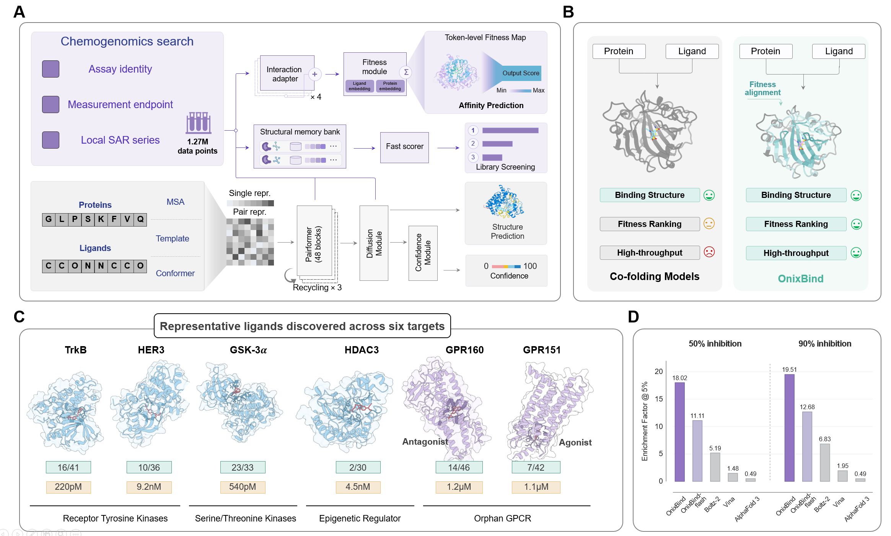

# OnixBind: **Inference-only protein-ligand binding affinity prediction**



<p align="center">
  | <a href="https://drive.google.com/file/d/1g7xs8-Xe-L30iecCbzKxz5WQ3xAKMLYR/view?usp=sharing">OnixBind</a> |
  <a href="https://drive.google.com/file/d/1vV5peOdo3Puqo7JktbbNrI8i5OoqlY8J/view?usp=sharing">OnixBind-Flash</a> |
</p>


## 1. OnixBind Overview

OnixBind takes protein sequences with their MSA and a small molecule as direct
inputs, and predicts the binding affinity of the complex as a single pX value
per record, where a higher value means stronger binding.

This repository is inference only: it contains no training code, no optimiser
state and no dataset tooling. The released model is a two-head ensemble over one
shared trunk — one trunk and one diffusion pass are run per record, two affinity
heads are evaluated on the same tensors, and their predictions are averaged. See
[docs/ENSEMBLE.md](docs/ENSEMBLE.md) for the head selection and benchmark scores.

**An A100 80GB or higher-memory GPU is recommended.**


## 2. Installation

### 2.1 OnixBind

**1. Prepare Input File**: Create an AlphaFold 3 input JSON following our
[input format specification](docs/input_format.md). A complete record is
provided at `src/examples/5S8I_A.json`.

**2. Download Cache Data and Model**: You can download from
[google drive](https://drive.google.com/drive/folders/1GcfLyZXnz4labCwyNKJnPwV_HICTTskB?usp=sharing). Place `onixbind.pt` in `src/weights/` and `ccd.pickle`
in `runtime/alphafold3/constants/converters/` before running inference.

**3. Installation and demo**:

To more complete installation instructions and usage, please refer to the
[Installation Guide](docs/installation.md).

```bash
conda env create --file src/environment.yaml
conda activate onixbind
export CUTLASS_PATH=/path/to/cutlass

cd src && bash predict.sh
```

**4. Output**: Predictions will be saved to: `./output/predictions`


## 2.2 Lightweight model: OnixBind-Flash

We provide a Jupyter Notebook demo for using OnixBind-Flash to perform inference on 10 targets.

**1. Download Required Files:**
To run the demo, Please download the demo trunk [here](https://drive.google.com/drive/folders/1SztEkVRMsbRlVFYv9S_2bGOmKkkqh_Nj?usp=drive_link), and OnixBind-Flash model checkpoints [here](https://drive.google.com/file/d/1vV5peOdo3Puqo7JktbbNrI8i5OoqlY8J/view?usp=sharing).

**2. File Placement:**
Unzip the downloaded files and place them in the src/onixbind-flash folder.

**3. Run Demo:**
Open and execute

```
inference_onixbind_flash.ipynb
```

This will generate predictions for the input file `demo_input.csv`, and the results will be saved in `inference_result.csv`.


## 3. Acknowledgements

- This repository uses the [AlphaFold 3](https://github.com/google-deepmind/alphafold3)
  inference data pipeline (feature processing and MSA handling), vendored under
  `runtime/`.
- [AuroBind](https://github.com/GENTEL-lab/AuroBind) is an earlier version of
  OnixBind.
- The implementation of **fast layernorm operators** is inspired by
  [OneFlow](https://github.com/Oneflow-Inc/oneflow) and
  [FastFold](https://github.com/hpcaitech/FastFold), following
  [Protenix](https://github.com/bytedance/Protenix)'s usage.


## 4. License

Unless otherwise stated, this code repository and the released OnixBind and
OnixBind-Flash model weights are licensed under the [Creative Commons
Attribution-NonCommercial-ShareAlike 4.0 International License (CC BY-NC-SA
4.0)](LICENSE). Third-party components retain their original licenses and
copyright notices.
